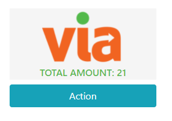

# Demo Template

TODO: Short component description.



## Installation

```bash
npm i -S -E @viamericas/demo-react-to-npm-package
```

> Please review [webpack.config.js](webpack.config.js) on `externals` property to check what packages need to install separately because they are not included in the package.

## Usage

Import package

```js
import Demo from '@viamericas/demo-react-to-npm-package';
```

TODO: Describe all special configurations, functions, states and/or property usages.

Create a function to show changes

```js
const onHandleChange = value => {
  console.log(value);
};
```

Component implementation

```jsx
<Demo
  inputA="{1}"
  inputB="{20}"
  onHandleChange="{onHandleChange}"
  className={className} {/* css wrapper */}
  t={t || loadTranslation()} {/* i18n */}
/>
```

> `inputA`, `inputB` and `onHandleChange` are required.  
> `t` (i18 translation) and `className` are optional.

## example

```jsx
<Demo inputA="{1}" inputB="{20}" onHandleChange="{onHandleChange}" />
```

## Language

```js
const { t } = useTranslation('translation');
```

> Check `dev-test/locales` folder for an example.

## Styles

This component does not have custom styles.

> Check `src/styles` folder for component styles.

---

## Developer

Hi! It's a guide where you going to can know how packaging project React, build and publish in a repository npm.

## Structure directory

| Path             | Description                                                                          |
| ---------------- | ------------------------------------------------------------------------------------ |
| `__test__`       | Contain the logic of the files of testings                                           |
| `build`          | This folder contains the transpiled code. It is auto-generated by the build command. |
| `coverage`       | This folder contains the code coverage. It is auto-generated by the command.         |
| `dev-test`       | This folder contains the development environment.                                    |
| `doc`            | Contains the project's documentation like user story, user case and diagrames.       |
| `node_modules`   | These directory is generated automatic by use 'npm install'.                         |
| `src`            | Contain your logic of application/component.                                         |
| `src/assets`     | Contain your resources like images, fonts...                                         |
| `src/core/*`     | Contain your all rules business.                                                     |
| `src/core/hooks` | Contain your custom hooks.                                                           |
| `src/index.js`   | It's application's start                                                             |

## How to publish the project

Follow the steps below:

- `npm login`
- `npm build`
- `npm publish` or `npm publish --scope=<organization_name>`
- `npm unpublish --scope=<organization_name> --force`

> `--scope` is only necessary if the package name in the `package.json` file does not have the company name as a prefix. Always the company name must be with the "@-2 at the beginning and a separator "/" at the end.

```json
{
  "name": "@viamericas/demo-react-to-npm-package"
}
```

## Validate weight of package

You can run the next commands to see the result of the bundle :

- `npm run build:debug`
- `npm run analizedependences`

> Need to have installed source-map-explorer globally.

```bash
npm install -g source-map-explorer
```
